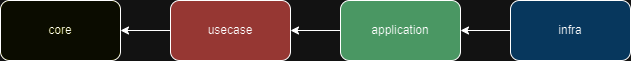

[](https://sonarcloud.io/summary/new_code?id=gervasioartur_walletwise-clean-rest-api)  [](https://github.com/gervasioartur/walletwise-clean-rest-api/actions/workflows/workflow.yml)

# walletwise-clean-rest-api

This project represents an in-depth study of a backend application developed using best practices and advanced software
development techniques. Utilizing a modular architecture based on Clean Architecture principles, this project integrates
a variety of patterns and methodologies aimed at ensuring clean, maintainable, and scalable code.

## Features

### User

- Create user
- Authenticate user

### Fixed expenses

- Add fixed expense
- Delete fixed expense
- Get fixed expense
- Get fixed expenses
- Update fixed expense

## Installation

Make sure to change application profile in directory `infra/src/main/resources/application.properties `.
To run tests use `test` profile and run the application `dev` profile.

### Prerequisites

- Java 21
- Maven 3.x
- PostgreSQL 12+
- Docker

### Steps to install

1. Clone the repository:
    ```bash
    git clone https://github.com/gervasioartur/walletwise-clean-rest-api.git
    ```
2. Navigate to project dir:
    ```bash
    cd walletwise-clean-rest-api
    ```
3. Run project with docker compose:
    ```bash
    docker compose up -d
    ```

### Running Tests

1. Run tests with coverage:
    ```bash
      mvn clean verify 
    ```

# Project Objective

This project contains an implementation of **Clean Architecture** using Java and Spring Boot. In addition to covering
Clean Architecture, the project also includes the implementation of a REST API architecture, as well as content on
software design, covering topics such as Design Patterns, caching, SOLID principles, and integration testing,
unit testing, BDD and DDD.

It is important to note that the goal of this repository is to reinforce the learning of Clean Architecture concepts.
The main focus is to provide a practical example for consolidating the studied content, without the intention of
serving as a complete solution for production use.


The diagram above illustrates Uncle Bob's proposal for Clean Architecture. Based on this proposal, the project contains
four modules, where each module represents a layer of Clean Architecture. See the image below.

- The ``core`` module contains the Enterprise Business Rules.
- The ``usecase`` module represents the Application Business Rules.
- The ``application`` module corresponds to the Interface Adapters.
- The ``infra`` module covers the Frameworks and Drivers.



### NOTE:

      In the _docs directory, you can find class diagrams,Entity RelationshipDiagrams 
      and BDD documentation.
